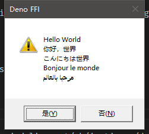

# deno_win32

Wraps some of the most common **Win32** API calls using FFI to make them
accessible to Deno.

## Usage

Write your apps that use the Windows API directly from Deno, by wrapping common
Win32 APIs using Deno FFI.

flags:

- `--allow-ffi`: Requires ffi access to "user32.dll"
- `--unstable`: FFI is unstable feature

## Examples

```bash
deno run --allow-ffi --unstable https://deno.land/x/win32/examples/MessageBox.ts
```

You will see:



### License

[deno_win32](https://github.com/denoffi/deno_win32) is released under the MIT
License. See the bundled [LICENSE](./LICENSE) file for details.
